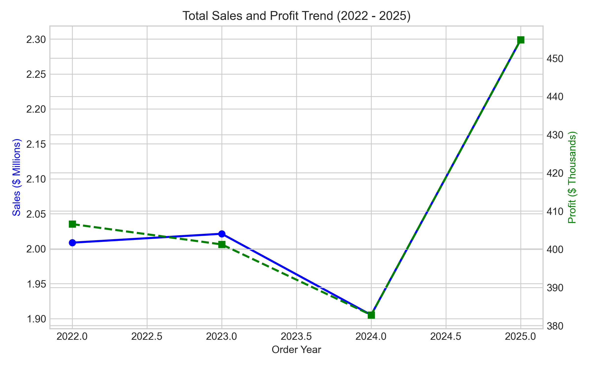
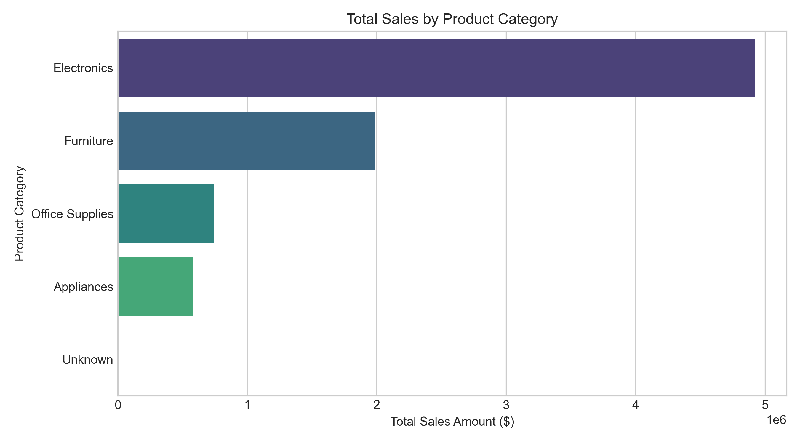
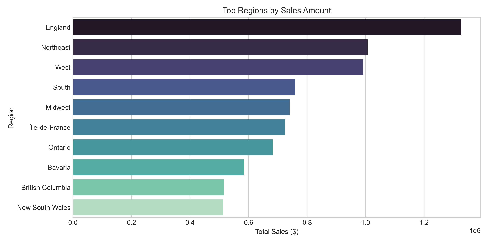
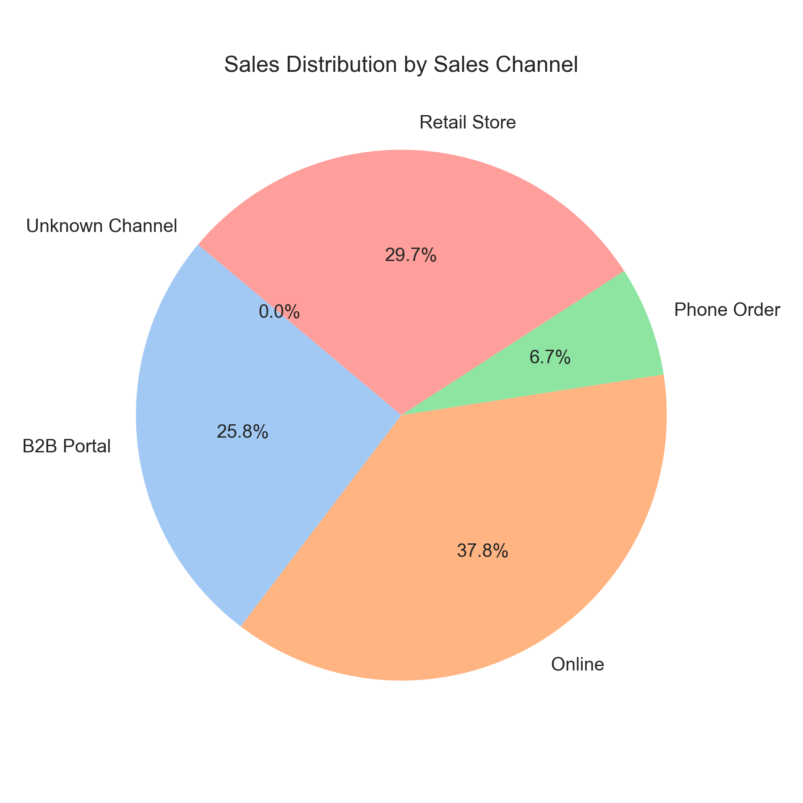
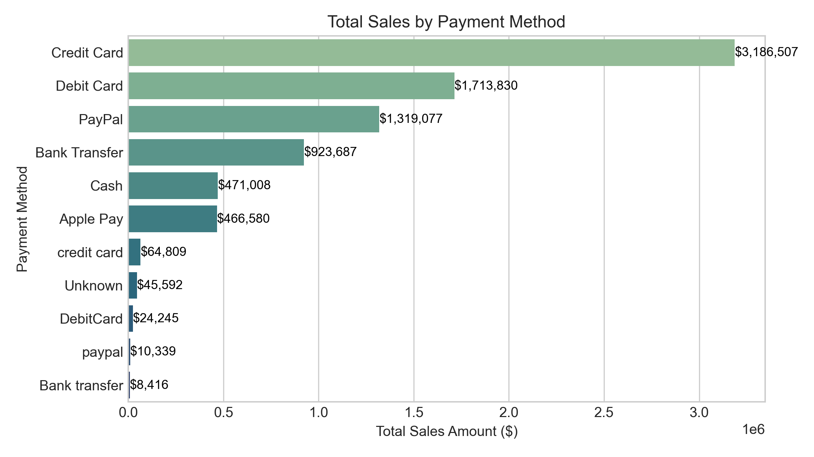

# SWYNEX-Exploratory-Data-Analysis
## Project Overview
This project performs Exploratory Data Analysis (EDA) on a prepared sales-transactions dataset covering 2022–2025. The analysis uses Python to summarize sales and profitability, compare customer and operational segments, investigate loss-making transactions, and visualize business trends.

### Key Objectives
* **Data Cleansing & Preparation:** Inspect missing values, correct data types, and engineer relevant features (such as total transaction value and date-time components).
* **Revenue & Financial Metrics:** Calculate total sales, Total Profit, Total Transactions,Total Units Sold, and profit margins.
* **Product & Category Insights:** Identify top-performing product categories, best-selling individual items, and underperforming inventory.
* **Temporal Trends:** Analyze sales performance across days, months, and seasons to spot peak shopping windows.
* **Anomaly & Return Analysis:** Investigate unusual transaction spikes, high-value outliers, and product return patterns.
- Understand the dataset structure and descriptive statistics.
- Calculate key business metrics, including total sales, total profit, profit margin, units, and transaction count.
- Compare sales and profit across product categories and order years.
- Investigate negative-profit transactions and their relationship with discounts.
- Examine shipping methods against customer ratings and delivery time.
- Explore return reasons, customer-segment performance, and promotion-code impact.
- Visualize yearly, category, regional, channel, and payment-method sales patterns.


## Tools & Libraries
- Jupyter Notebook
* **Language:** Python
* **Data Manipulation & Analysis:**
* - pandas — data loading, cleaning of category labels, grouping, and aggregation
* - NumPy
* **Data Visualization:**
* - Matplotlib — charts
* - Seaborn — statistical plotting and chart styling
  
## 📊 Dataset

**Dataset:** Sales_transactions_2022_2025  - Dirty Data for Cleaning Training  
**Source:** Kaggle
**Period:** 2022–2025
**Rows:** 18,045 
**Columns:** 36
**Data type:** Raw, uncleaned transaction data
**About this file**
It is a Multi-Channel Retail & B2B Sales Transaction Dataset simulating sales of office equipment, electronics, furniture, appliances, and office supplies across multiple sales channels.
The dataset contains sales transactions with intentionally introduced data quality issues such as missing values, invalid entries, inconsistent values, and incorrect data types.

The notebook loads a cleaned and prepared CSV file named:

`Sales_transactions_2022_2025 cleaned & prepared.csv`

The dataset is expected to contain fields used in the notebook, including `Transaction_ID`, `Customer_Age`, `Quantity`, `Unit_Price`, `Discount_Percentage`, `Sales_Amount`, `Profit`, `Delivery_Days`, `Customer_Rating`, `Product_Category`, `Order_Year`, `Shipping_Method`, `Return_Reason`, `Customer_Segment`, `Promotion_Code`, `Region`, `Sales_Channel`, and `Payment_Method`.

**Note:** The CSV is not embedded in this notebook. Place it in your working directory or update the file path in the first notebook cell before running.

## Analysis Workflow
1. **Load data** from the prepared CSV using pandas.
2. **Dataset overview & descriptive statistics** for selected numeric columns.
3. **Key performance indicators (KPIs):** total sales, total profit, overall profit margin, total quantity, and transaction count.
4. **Category and yearly aggregation:** normalize product-category labels and summarize sales/profit.
5. **Anomaly review:** count negative-profit transactions and calculate their average discount.
6. **Shipping analysis:** compare average customer rating, order count, and average delivery days by shipping method.
7. **Returns analysis:** count return reasons.
8. **Customer-segment analysis:** compare total/average sales, total/average profit, and quantity.
9. **Promotion analysis:** compare average sales, average profit, and transaction count by promotion code.
10. **Visualizations:** generate charts for yearly sales and profit, sales by product category, top 10 regions by sales, sales-channel distribution (donut chart), and sales by payment method.
    
## Key Performance Indicators

| KPI | Value |
|Total Sales Amount:| $8,234,090.60|
|Total Profit:| $1,645,439.40|
|Overall Profit Margin:| 19.98%|
|Total Units Sold:| 38,289|
|Total Transactions:| 18,001|

# 📊 Summary Statistics

This dataset contains **18,001 transactions** with customer demographics, product details, and sales metrics. Below is a statistical overview:

| Feature              | Count   | Mean     | Std Dev   | Min   | 25%   | 50%   | 75%   | Max    |
|----------------------|---------|----------|-----------|-------|-------|-------|-------|--------|
| **Customer Age**     | 18,001  | 38.92    | 10.66     | 4     | 32    | 39    | 46    | 112    |
| **Quantity**         | 18,001  | 2.13     | 1.78      | 0     | 1     | 2     | 3     | 11     |
| **Unit Price ($)**   | 18,000  | 232.78   | 294.25    | 21.39 | 52.96 | 99.85 | 285.78| 1425.09|
| **Discount (%)**     | 18,001  | 6.25     | 6.88      | 0     | 0     | 5     | 10    | 110    |
| **Sales Amount ($)** | 18,000  | 457.45   | 857.10    | 16.68 | 78.53 | 168.85| 472.74| 14303.07|
| **Profit ($)**       | 18,000  | 91.41    | 167.86    | -299.31| 19.49| 40.19 | 93.30 | 3512.08|
| **Delivery Days**    | 18,001  | 2.24     | 2.32      | 0     | 0     | 1     | 4     | 10     |
| **Customer Rating**  | 18,001  | 3.23     | 1.81      | 0     | 2     | 4     | 5     | 5      |

---

## 🔑 Key Insights
- Average customer age is **~39 years**, with a wide range (4–112).
- Most purchases involve **1–3 units**, but some go up to 11.
- Unit prices vary significantly, with a few high-value items ($1,425 max).
- Discounts are typically **0–10%**, but extreme cases reach 110%.
- Average sales amount is **$457**, but outliers push up to **$14,303**.
- Profit margins are positive on average, but some transactions show **losses**.
- Delivery is usually completed within **1–4 days**.
- Customer ratings cluster around **3–4 stars**, with some extremes at 0 and 5.

---

📌 This section helps readers quickly understand the **distribution and variability** of your dataset before diving into deeper analysis.

## 📊 Key Insights from Exploratory Data Analysis

The EDA explores sales performance, profitability, customer behavior, and business operations to identify meaningful business insights.

### 1. Yearly Sales and Profit Trend
- Analyzes yearly sales and profit from 2022 to 2025.
- Helps identify growth trends, declining performance, and changes in profitability.
- Supports year-wise business performance evaluation.

### 2. Sales by Product Category
- Identifies product categories contributing the most and least to total revenue.
- Helps understand product demand and category-wise sales performance.
- Supports inventory management and marketing decisions.

### 3. Top 10 Regions by Sales
- Highlights the top-performing regions based on sales amount.
- Helps identify regional sales concentration and differences in revenue contribution.
- Supports regional sales planning and marketing strategies.

### 4. Sales Distribution by Channel
- Compares the contribution of different sales channels to total revenue.
- Helps identify major sales channels and understand channel-wise performance.
- Supports sales channel optimization.

### 5. Sales by Payment Method
- Analyzes sales generated through different payment methods.
- Helps understand customer payment preferences.
- Supports payment option and transaction strategy improvements.

### 6. Profitability and Discount Analysis
- Investigates transactions with negative profit.
- Examines the relationship between discounts and profitability.
- Helps identify potential loss-making transactions and review discount strategies.

### 7. Customer Segment and Promotion Analysis
- Compares sales, profit, and quantity across customer segments.
- Evaluates promotion-code performance using average sales, average profit, and transaction count.
- Helps identify customer and promotional patterns for business planning.

### 8. Shipping and Return Analysis
- Compares shipping methods based on order count, average delivery days, and customer ratings.
- Analyzes return reasons to identify common return patterns.
- Supports delivery performance evaluation and customer-experience improvements.

## 💡 Business Conclusion

This EDA provides a data-driven understanding of sales trends, revenue contribution, profitability, customer behavior, and operational performance. The analysis can help businesses identify areas for improvement, optimize sales and discount strategies, understand customer preferences, and make informed business decisions.


## 📊 Sales Analysis
### Visualizations
- Yearly Sales and Profit Trend (2022–2025)
  
- Total Sales by Product Category
  
- Top Regions by Sales Amount
  
- Sales Distribution by Sales Channel
  
- Total Sales by Payment Method
  
- Top 10 Best Selling Items
  (Total Sales by Payment Method.png)

## How to Run
1. Clone or download this repository.
2. Ensure Python and Jupyter Notebook are installed.
3. Install the required libraries:
   ```bash
   pip install pandas numpy matplotlib seaborn jupyter
   ```
4. Add the CSV dataset to the appropriate location.
5. Open `Task 2 EDA.ipynb` in Jupyter Notebook.
6. Update the CSV path in the first cell if needed.
7. Run the notebook cells from top to bottom.
```

## 👤 Author

**Malayasis Banerjee**  

Data Analyst Intern | Aspiring Data Analyst
#DataAnalytics #ExploratoryDataAnalysis #SWYNEXTechnologies
